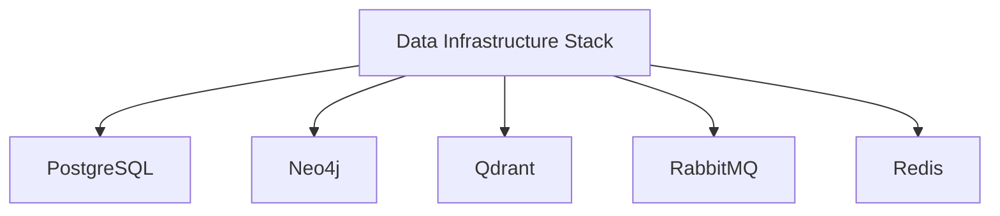

# Data Infrastructure Stack Architecture & Conventions

## Overview

This document defines the architecture and conventions for the Data Infrastructure Stack, a Docker Compose–based deployment of five independent data services (PostgreSQL, Neo4j, Qdrant, RabbitMQ, Redis) on a single production host. It serves as a reference for AI agents and developers working with this repository.

---

## Stack Architecture

| Service | Purpose | Isolation | Access Pattern |
|---|---|---|---|
| **PostgreSQL** | Relational database | Dedicated container | `0.0.0.0:65432` → `5432` (host) |
| **Neo4j** | Graph database | Dedicated container | `7473` (HTTPS), `7687` (Bolt), `2004` (metrics), `7474` (HTTP, tunnel ingress) |
| **Qdrant** | Vector database | Internal network `platform-qdrant` | `127.0.0.1:6334` (gRPC) |
| **RabbitMQ** | Message broker | Dedicated container | `0.0.0.0:5672,15672,5671,4369,25672` (host) |
| **Redis** | Cache / key-value store | Dedicated container | `0.0.0.0:6379` (host) |

Each service is independently deployable, independently backed up, and independently documented.

---

## Conventions

### 1. Service Isolation

- Each service runs in its own Docker container with dedicated volumes for data, logs, and backups.
- Services are started/stopped independently via their own `docker-compose.yml`. There is no root-level `docker-compose.yml`.
- Services are exposed either directly on `0.0.0.0` or restricted to an internal Docker network + Cloudflare Tunnel, depending on the service's security posture.

### 2. Secrets & Environment Handling

- **Never commit `.env` files.** Only `.env.example` (placeholder values) is tracked in git.
- Neo4j uses a **Docker secret file** (`neo4j-production/secrets/neo4j_auth`) instead of an env var for credentials.
- Redis uses **ACL-based multi-user auth** (`redis/config/users.acl`) — passwords are injected via environment variables at container start, not hardcoded in the ACL file.
- Qdrant uses a **7-key, per-project API key scheme** — see [`qdrant/README.md`](./qdrant/README.md).
- All credential material, TLS certificates, backups, snapshots, and runtime data directories are excluded via [`.gitignore`](./.gitignore).

### 3. Backup & Recovery

- Each service has its own backup procedure (see individual service READMEs).
- Backups are written locally only — off-host copies are not automated.
- Backup scripts are located in each service's `scripts/` directory.

### 4. Documentation

- Each service has a dedicated README.md (runbook) with:
  - Quick start instructions
  - Credentials table
  - Health checks
  - Backup/restore procedures
  - Troubleshooting
  - Known limitations

- The root [`README.md`](./README.md) provides an overview of the entire stack.

### 5. Agent Conventions

- **AGENTS.md** (this file) — architecture & conventions reference for AI agents / developers.
- **`AGENTS`** — AI agents should use this file as a reference for the stack architecture and conventions.
- **`AGENTS`** — AI agents should use the individual service READMEs for operational details.

---

## Agent Workflow

1. **Discovery**: Use this file to understand the stack architecture and conventions.
2. **Service-Specific Work**: Refer to each service's README.md for operational details.
3. **Backup & Recovery**: Use the backup scripts in each service's `scripts/` directory.
4. **Troubleshooting**: Refer to the troubleshooting sections in each service's README.md.

---

## License

Internal infrastructure repository. No license specified — all rights reserved unless stated otherwise.
